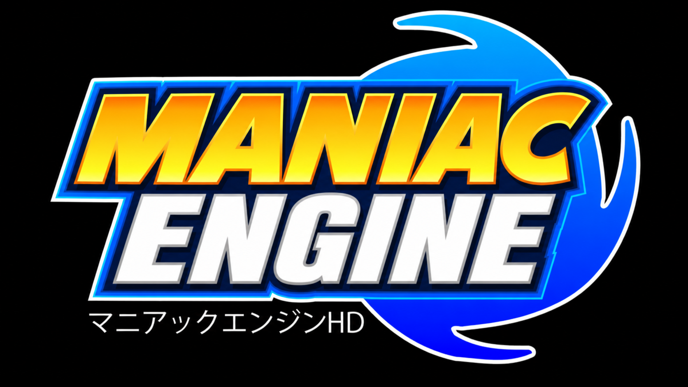

<p align="center">
  
</p>

<h1 align="center">Maniac Engine</h1>

<p align="center">
  A game development engine based on <b>RSDKv5U</b>, the real engine behind <i>Sonic Mania</i>, built from its public decompilation.
</p>

<p align="center">
  
  
  
</p>

---

## 📖 About the project

**Maniac Engine** is a game engine derived from **RSDKv5U** (Retro Engine v5), the original engine behind *Sonic Mania*, built on top of the [decompilation](https://github.com/RSDKModding/Sonic-Mania-Decompilation) maintained by the RSDK Modding community.

The goal of the project is to take that technical foundation (physics, rendering, scene system, collisions, audio) and adapt it to build **original games** — not mods or one-off conversions, but a reusable engine to develop different projects on top of.

> ⚠️ This is a non-profit fan project. Not affiliated with SEGA. Requires a legitimate copy of Sonic Mania to compile and run, since it relies on base files from the original engine.

---

## ✨ Features

- ⚙️ Built on the real **RSDKv5U** engine (physics, camera, collisions, scenes, audio)
- 🎨 Graphics system compatible with Mania-style sprites, tilesets, and palettes
- 🗺️ Scene and level editing via **RetroED**
- 📦 Asset packaging (`Data.rsdk`) using community-made tools
- 🧩 Designed as a reusable base for multiple projects/games, not a single game

---

## 🧰 Technical requirements

To compile the engine you need:

- Visual Studio Build Tools (Desktop development with C++)
- [CMake](https://cmake.org/download/)
- [vcpkg](https://github.com/microsoft/vcpkg)
- A legitimate copy of **Sonic Mania** (for the base `Data.rsdk` / `Game.dll` files)

### Dependencies (via vcpkg)
```
libtheora libogg glew glfw3 sdl2
```

---

## 🚀 Building

```powershell
git clone --recursive https://github.com/RSDKModding/Sonic-Mania-Decompilation
cd Sonic-Mania-Decompilation

cmake -B build -G "Visual Studio 17 2022" `
  -DCMAKE_TOOLCHAIN_FILE="[path to vcpkg]/scripts/buildsystems/vcpkg.cmake" `
  -DVCPKG_TARGET_TRIPLET=x64-windows-static

cmake --build build --config Release
```

The resulting executable (`RSDKv5U.exe`) and `Game.dll` will be located at:
```
build/dependencies/RSDKv5/Release/
```

Place your `Data.rsdk` (from your legitimate copy of Sonic Mania) there to run the engine.

---

## 🗂️ Project structure

```
Maniac Engine/
├── Sonic-Mania-Decompilation/   # Base source code of the RSDKv5U engine
├── vcpkg/                       # Dependency manager
├── build/                       # Build output
└── projects/                    # Games/projects built on top of the engine (future)
```

---

## 🛠️ Tools used

| Tool | Purpose |
|---|---|
| [RetroED](https://github.com/Rubberduckycooly) | Scene, tile, and collision editing |
| RSDKv5_Extract_Plus | Extraction/repacking of `Data.rsdk` |
| RSDK Animation Editor | Sprite and animation editing |

---

## 📌 Current status

- [x] Engine compiled and running from source
- [x] Dev Menu enabled
- [ ] Engine API/scripting documentation
- [ ] First test project built on the engine

---

## 📜 Credits

- Original engine: **SEGA** / *Sonic Mania* team (Christian Whitehead, Headcannon, PagodaWest Games)
- Base decompilation: **RSDK Modding** community
- This project's development: *LaxyDev64/LaxStudio*

---

<p align="center">マニアックエンジンHD</p>
